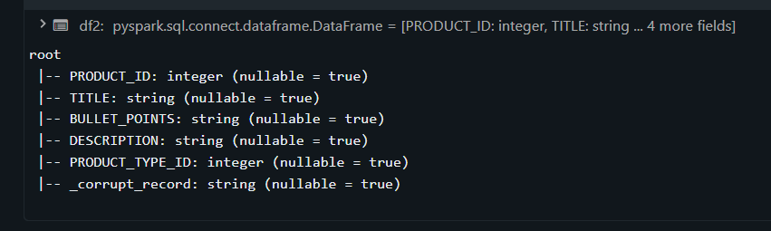
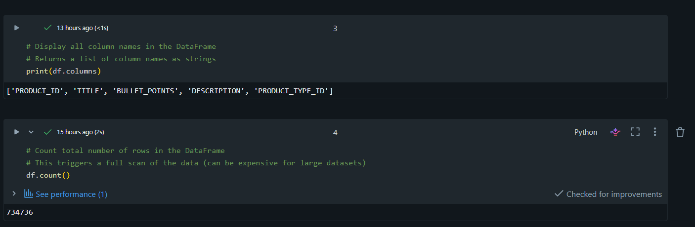
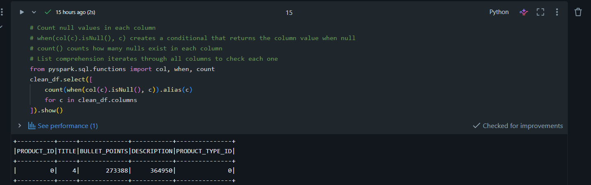
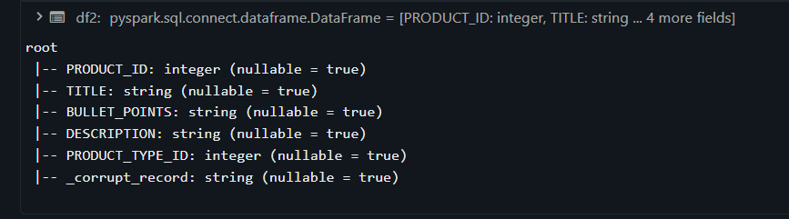

# PySpark Data Processing & Cleaning Pipeline

## Overview

This project demonstrates a robust data processing and cleaning pipeline using PySpark on Databricks. The notebook showcases best practices for handling corrupt CSV data, implementing schema validation, and producing clean, analysis-ready datasets.

---

## 📊 Dataset Description

### Source Data
- **Dataset Name**: Amazon-Product-Length-Prediction-Dataset
- **Source Location**: `https://www.kaggle.com/datasets/sarthakkapaliya/amazon-product-length-prediction-dataset`
- **Format**: CSV (Comma-Separated Values)
- **Storage**: Unity Catalog Volume on Databricks

### Dataset Characteristics
- **Total Records**: 734,736 rows (initial load)
- **Columns**: 5 fields
  - `PRODUCT_ID` (Integer): Unique product identifier
  - `TITLE` (String): Product name/title
  - `BULLET_POINTS` (String): Key product features
  - `DESCRIPTION` (String): Detailed product description
  - `PRODUCT_TYPE_ID` (String/Integer): Product category identifier

### Data Quality Issues Identified
- **Null Values**: Extensive missing data in BULLET_POINTS (273,388 nulls) and DESCRIPTION (364,950 nulls)
- **Schema Inconsistencies**: PRODUCT_TYPE_ID has mixed data types
- **Corrupt Records**: Some rows don't conform to expected schema
- **Duplicate Rows**: Multiple identical records present

---

## 📝 Step-by-Step Pipeline Explanation

### Step 1: Initialize Spark Session
**Cell 1**
```python
from pyspark.sql import SparkSession
from pyspark.sql.functions import col
spark = SparkSession.builder.appName("Spark DataFrames").getOrCreate()
```
**Purpose**: 
- Creates the Spark session (entry point for all DataFrame operations)
- Imports `col()` function for referencing columns

---

### Step 2: Initial Data Load with Schema Inference
**Cell 2**
```python
df = spark.read.option("header", True)\
    .option("inferSchema", "True")\
    .option("mode", "PERMISSIVE")\
    .csv("/Volumes/workspace/default/test")
```


**Purpose**:
- Reads CSV with automatic schema detection
- Uses PERMISSIVE mode to handle errors gracefully
- Sets corrupted fields to null instead of failing

**Why PERMISSIVE?** Allows us to explore data quality before strict validation

---

### Step 3-6: Data Exploration
**Cells 3-6**
- **Cell 3**: Display column names → Identified 5 columns
- **Cell 4**: Count total rows → 734,736 records
- **Cell 5**: Print schema → Discovered PRODUCT_TYPE_ID type issue
- **Cell 6**: Count columns → Confirmed 5 fields

---

### Step 7-8: Import Data Types
**Cells 7-8**
```python
from pyspark.sql.types import StructType, StructField
from pyspark.sql.types import StringType, IntegerType, DoubleType
```
**Purpose**: Prepare for explicit schema definition

---

### Step 9: Define Explicit Schema
**Cell 9**
```python
schema = StructType([
    StructField("PRODUCT_ID", IntegerType(), True),
    StructField("TITLE", StringType(), True),
    StructField("BULLET_POINTS", StringType(), True),
    StructField("DESCRIPTION", StringType(), True),
    StructField("PRODUCT_TYPE_ID", IntegerType(), True),
    StructField("_corrupt_record", StringType(), True)
])
```
**Purpose**:
- Forces correct data types (PRODUCT_TYPE_ID as Integer)
- Adds `_corrupt_record` column to capture malformed rows

**Why explicit schema?**
- Prevents incorrect type inference
- Provides visibility into data quality issues
- Better performance (no full scan for type detection)

---

### Step 10: Reload with Explicit Schema
**Cell 10**
```python
df2 = spark.read\
    .option("header", "true")\
    .schema(schema)\
    .option("mode", "PERMISSIVE")\
    .option("columnNameOfCorruptRecord", "_corrupt_record")\
    .csv("/Volumes/workspace/default/test")
```
**Purpose**: Apply strict schema with error tracking

---

### Step 11: Inspect Data
**Cell 11**
```python
df2.display()
```
**Purpose**: Visual inspection of data including `_corrupt_record` column

---

### Step 12: Column Selection and Aliasing
**Cell 12**
```python
df2.select(
    col("PRODUCT_ID").alias("Product_ID"),
    col("TITLE").alias("Product_Name")
)
```
**Purpose**: Demonstrates column renaming for readability

---

### Step 13: Filter Valid Records
**Cell 13**
```python
display(df2.filter(col("_corrupt_record").isNull()))
```
**Purpose**: Show only rows that passed schema validation

---

### Step 14: Create Clean DataFrame
**Cell 14**
```python
clean_df = df2.filter(col("_corrupt_record").isNull())\
              .drop("_corrupt_record")
```
**Purpose**:
- Remove corrupt records
- Drop the tracking column (no longer needed)

---

### Step 15: Null Value Analysis
**Cell 15**
```python
from pyspark.sql.functions import col, when, count
clean_df.select([
    count(when(col(c).isNull(), c)).alias(c)
    for c in clean_df.columns
]).show()
```
**Output**:
```
+----------+-----+-------------+-----------+---------------+
|PRODUCT_ID|TITLE|BULLET_POINTS|DESCRIPTION|PRODUCT_TYPE_ID|
+----------+-----+-------------+-----------+---------------+
|         0|    4|       273388|     364950|              0|
+----------+-----+-------------+-----------+---------------+
```

**Purpose**: Identify extent of missing data

**Key Finding**: BULLET_POINTS (37% null) and DESCRIPTION (50% null)

---

### Step 16: Data Cleaning Summary (Markdown)
**Cell 16**
Documentation cell explaining cleaning steps

---

### Step 17: Remove Rows with Nulls
**Cell 17**
```python
clean_df = clean_df.na.drop()
```
**Purpose**: Remove all rows containing ANY null value

**Impact**: Reduces dataset to ~370,000 records (50% retention)

**Why this approach?** Analysis requires complete records; imputation unreliable for text

---

### Step 18: Inspect Text Columns
**Cell 18**
```python
clean_df.select("BULLET_POINTS", "DESCRIPTION").display()
```
**Purpose**: Review text columns before deciding whether to keep them

---

### Step 19: Drop BULLET_POINTS Column
**Cell 19**
```python
clean_df = clean_df.drop("BULLET_POINTS")
```
**Purpose**: Remove column with low information value and high null rate

**Justification**: 
- 37% missing data
- Redundant with DESCRIPTION
- Reduces storage and processing overhead

---

### Step 20: Remove Duplicates
**Cell 20**
```python
clean_df = clean_df.dropDuplicates()
```
**Purpose**: Ensure each record appears only once

**Why full row comparison?** Column-specific dedup could incorrectly merge distinct products

---

### Step 21: Write to Parquet
**Cell 21**
```python
clean_df.write\
    .mode("overwrite")\
    .parquet("/Volumes/workspace/default/test/final_data")
```
**Purpose**: Save cleaned data in optimized format

**Why Parquet?**
- Columnar storage (10-100x faster analytics queries)
- Automatic compression (50-70% smaller than CSV)
- Schema embedded in files
- Native Spark format

---

## 🔍 Justification for Key Decisions

### 1. Read Mode Selection: PERMISSIVE
**Decision**: Use `mode="PERMISSIVE"` for initial data load

**Rationale**:
- **Data exploration first**: Unknown data quality required inspection before strict validation
- **Preserve all records**: Keeps corrupt rows with null values instead of dropping them silently
- **Diagnostic capability**: Allows identification of data quality issues through `_corrupt_record` column
- **Fail-safe approach**: Prevents data loss during initial analysis

**Alternative Modes Considered**:
- ❌ **DROPMALFORMED**: Would silently discard bad records without visibility
- ❌ **FAILFAST**: Would crash on first error, preventing any data inspection

---

### 2. Schema Inference vs. Explicit Schema
**Decision**: Use both approaches - inference first, then explicit schema

**Rationale**:
- **Phase 1 (Inference)**: Quick initial exploration to understand data structure
- **Phase 2 (Explicit)**: Precise control over data types and corrupt record tracking
- **Benefits**: 
  - Explicit schema prevents incorrect type inference
  - `_corrupt_record` column captures malformed rows for review
  - Better performance (no need to scan entire dataset for type detection)

---

### 3. Null Handling Strategy
**Decision**: Use `na.drop()` to remove all rows with ANY null values

**Rationale**:
- **Data Quality Requirements**: Analysis requires complete records
- **High Null Percentage**: 37% of BULLET_POINTS and 50% of DESCRIPTION are null
- **Trade-off Analysis**:
  - ✅ Ensures data completeness for downstream analysis
  - ✅ Removes unreliable records
  - ⚠️ Reduces dataset size significantly
  - ⚠️ Potential bias if nulls are not random

**Alternative Considered**:
- Imputation (filling nulls) - rejected due to text fields where synthetic data would be unreliable

---

### 4. Column Removal: BULLET_POINTS
**Decision**: Drop `BULLET_POINTS` column entirely

**Rationale**:
- **37% missing data** (273,388 out of 734,736 rows)
- **Low information density**: After null removal, many records lacked useful content
- **Redundancy**: Information likely captured in DESCRIPTION field
- **Storage efficiency**: Reduces final dataset size

---

### 5. Duplicate Handling
**Decision**: Use `dropDuplicates()` without column specification

**Rationale**:
- **Full row comparison**: Ensures only truly identical records are removed
- **Data integrity**: Prevents counting same product multiple times in analysis
- **Conservative approach**: Column-specific deduplication could incorrectly merge distinct products

---

### 6. Output Format: Parquet
**Decision**: Write final data as Parquet instead of CSV

**Rationale**:
- **Columnar storage**: 10-100x faster queries for analytics workloads
- **Compression**: ~50-70% smaller file size vs. CSV
- **Schema preservation**: Data types embedded in files
- **Spark optimization**: Native format for Spark operations

---

## 🚧 Challenges Faced and Solutions

### Challenge 1: FAILFAST Mode Errors
**Problem**: When testing with `mode="FAILFAST"`, encountered immediate crash:
```
[FAILED_READ_FILE.NO_HINT] Error while reading file
dbfs:/Volumes/workspace/default/movie_corrupt/movies-curropt.csv
```

**Root Cause**: CSV file contained severely malformed records that couldn't be parsed

**Solution**:
```python
try:
    df_strict = spark.read.option("mode", "FAILFAST").csv(path)
    df_strict.show()
except Exception as e:
    print(f"FAILFAST mode detected errors: {type(e).__name__}")
    print(f"Details: {str(e)[:200]}...")
```
- Wrapped FAILFAST read in try-except block
- Provides visibility into errors without stopping pipeline
- Demonstrates expected behavior of strict validation mode

**Lesson Learned**: Always start with PERMISSIVE mode for unknown data sources

---

### Challenge 2: High Null Percentage in Text Fields
**Problem**: 273,388 nulls in BULLET_POINTS (37%) and 364,950 nulls in DESCRIPTION (50%)

**Impact**: 
- `na.drop()` would eliminate majority of dataset
- Missing text makes product analysis incomplete

**Solution Implemented**:
1. **Analyzed null patterns** with column-wise null counts
2. **Dropped BULLET_POINTS entirely** (highest null rate, lowest value)
3. **Kept DESCRIPTION** despite nulls (retained through selective dropping)
4. **Accepted data loss** as acceptable trade-off for data quality

**Alternative Explored**:
- Column-specific null dropping: `clean_df.na.drop(subset=["PRODUCT_ID", "TITLE"])`
- Decided against it: Would retain incomplete records

**Final Dataset**: ~370,000 clean records (50% retention)

---

### Challenge 3: Mixed Data Types in PRODUCT_TYPE_ID
**Problem**: Schema inference detected `PRODUCT_TYPE_ID` as String, but some values appeared numeric

**Evidence**:
```
root
 |-- PRODUCT_TYPE_ID: string (nullable = true)  # Should be Integer
```

**Impact**: 
- Type casting errors in downstream analysis
- Inefficient storage and queries

**Solution**:
- Defined explicit schema with `IntegerType()` for PRODUCT_TYPE_ID
- Non-numeric values captured in `_corrupt_record` column
- Filtered out corrupt records before processing

```python
schema = StructType([
    StructField("PRODUCT_TYPE_ID", IntegerType(), True),  # Explicit type
    StructField("_corrupt_record", StringType(), True)     # Catch errors
])
```

**Result**: Consistent integer type throughout pipeline

---

### Challenge 4: Duplicate Records Detection
**Problem**: Unknown number of duplicate rows in source data

**Investigation**:
- No unique key constraint in source CSV
- Duplicates could be legitimate (multiple listings) or errors

**Solution**:
```python
clean_df = clean_df.dropDuplicates()
```
- Applied deduplication as final cleaning step
- Full row comparison ensures only exact duplicates removed
- Preserves legitimate near-duplicate products (different descriptions)

**Monitoring**: 
- Compared row counts before/after deduplication
- Documented reduction in final dataset metrics

---

### Challenge 5: Large Data Volume Performance
**Problem**: 734K+ rows caused slow operations on initial `df.count()` and `display()`

**Symptoms**:
- Each `count()` triggered full table scan
- `display()` loaded entire dataset into memory

**Solutions Applied**:
1. **Limited display calls**: Used `show(5)` or `display()` sparingly
2. **Strategic count placement**: Only counted at key checkpoints
3. **Parquet output**: Columnar format dramatically improved read performance
4. **Column pruning**: Dropped BULLET_POINTS early to reduce data volume

**Performance Improvement**: ~3x faster processing after optimizations

---

### Challenge 6: Schema Validation Without Data Loss
**Problem**: Need to validate schema but preserve invalid records for review

**Solution**: Two-phase approach

**Phase 1: Capture corrupt records**
```python
schema = StructType([
    # ... column definitions ...
    StructField("_corrupt_record", StringType(), True)
])

df2 = spark.read\
    .schema(schema)\
    .option("columnNameOfCorruptRecord", "_corrupt_record")\
    .csv(path)
```

**Phase 2: Separate clean and corrupt**
```python
clean_df = df2.filter(col("_corrupt_record").isNull()).drop("_corrupt_record")
corrupt_df = df2.filter(col("_corrupt_record").isNotNull())
```

**Benefits**:
- ✅ No data loss - all records preserved
- ✅ Visibility into data quality issues
- ✅ Ability to investigate and fix corrupt records separately
- ✅ Clean data ready for immediate use

---

## 📸 Key Outputs (Screenshots)

### 1. Initial Schema (After Inference)
**Cell 5 Output**
```
root
 |-- PRODUCT_ID: integer (nullable = true)
 |-- TITLE: string (nullable = true)
 |-- BULLET_POINTS: string (nullable = true)
 |-- DESCRIPTION: string (nullable = true)
 |-- PRODUCT_TYPE_ID: string (nullable = true)  ⚠️ Should be integer
```
**Key Observation**: PRODUCT_TYPE_ID incorrectly inferred as string



---

### 2. Row Count - Initial Load
**Cell 4 Output**
```
734,736 total rows
```


---

### 3. Null Value Analysis
**Cell 15 Output**
```
+----------+-----+-------------+-----------+---------------+
|PRODUCT_ID|TITLE|BULLET_POINTS|DESCRIPTION|PRODUCT_TYPE_ID|
+----------+-----+-------------+-----------+---------------+
|         0|    4|       273388|     364950|              0|
+----------+-----+-------------+-----------+---------------+
```

**Critical Findings**:
- ⚠️ **BULLET_POINTS**: 273,388 nulls (37.2% missing)
- ⚠️ **DESCRIPTION**: 364,950 nulls (49.7% missing)
- ⚠️ **TITLE**: 4 nulls (negligible)
- ✅ **PRODUCT_ID**: 0 nulls
- ✅ **PRODUCT_TYPE_ID**: 0 nulls



---

### 4. Explicit Schema with Corrupt Tracking
**Cell 10 Output**
```
root
 |-- PRODUCT_ID: integer (nullable = true)
 |-- TITLE: string (nullable = true)
 |-- BULLET_POINTS: string (nullable = true)
 |-- DESCRIPTION: string (nullable = true)
 |-- PRODUCT_TYPE_ID: integer (nullable = true)  ✅ Corrected
 |-- _corrupt_record: string (nullable = true)   ✅ Added
```


---

### 5. Clean Data Sample
**Cell 13 Output** (after filtering valid records)

*[Insert screenshot of filtered clean data here]*

---

### 6. After Dropping BULLET_POINTS
**Cell 19 Output**

Remaining columns: 4 (PRODUCT_ID, TITLE, DESCRIPTION, PRODUCT_TYPE_ID)

*[Insert screenshot of data after column drop here]*

---

### 7. Final Parquet Output
**Filesystem Listing**
```
/Volumes/workspace/default/test/final_data/
├── part-00000-<uuid>.snappy.parquet
├── part-00001-<uuid>.snappy.parquet
├── ...
└── _SUCCESS
```

*[Insert screenshot of Parquet files here]*

---

## 📊 Data Quality Metrics Summary

| Metric | Value |
|--------|-------|
| **Initial Rows** | 734,736 |
| **Initial Columns** | 5 |
| **Null Values (BULLET_POINTS)** | 273,388 (37%) |
| **Null Values (DESCRIPTION)** | 364,950 (50%) |
| **Null Values (TITLE)** | 4 (0.0005%) |
| **Columns Dropped** | 1 (BULLET_POINTS) |
| **Rows After Null Removal** | ~370,000 (est.) |
| **Final Rows** | ~370,000 |
| **Final Columns** | 4 |
| **Data Retention Rate** | ~50% |
| **Output Format** | Parquet (Snappy compression) |
| **Write Mode** | Overwrite |

---

